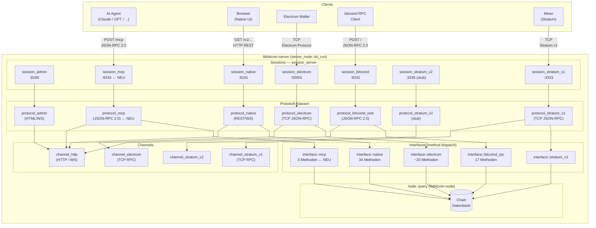

# MCP Server — Implementierungsvorschlag

## Stack-Analyse

### Bestehende Architektur

Der Server folgt einem strikten Schichtmodell:

```
server_node::do_run()
    └── start_admin   → session_admin   = session_server<protocol_admin>
    └── start_native  → session_native  = session_server<protocol_native>
    └── start_bitcoind → session_bitcoind = session_server<protocol_bitcoind_rest>
    └── start_electrum → session_electrum = session_handshake<…>
    └── start_stratum_v1 → session_stratum_v1
    └── start_stratum_v2 → session_stratum_v2
```

Jedes Protokoll ist ein Tripel aus **Settings** (Konfiguration/Port), **Session** (Connection-Management) und **Protocol** (Logik). HTTP-basierte Protokolle teilen `channel_http` und erben von `protocol_http`.

### Vererbungsbaum (relevant)

```
server::protocol → node::protocol
└── protocol_http → network::protocol_http
    ├── protocol_html
    │   ├── protocol_admin
    │   └── protocol_native          ← REST API, WebSocket
    └── protocol_bitcoind_rpc        ← JSON-RPC 2.0 / HTTP
        └── protocol_bitcoind_rest
```

### Schnittstellen-System

Jede Protokoll-Klasse deklariert ihr API als `interface::X = publish<X_methods>`, wobei `X_methods` ein `constexpr std::tuple` von `method<"name", ...Args>` ist. Ein generischer `rpc::dispatcher<interface>` übernimmt Routing und Deserialisierung.

---

## MCP-Protokoll (Kurzübersicht)

MCP (Model Context Protocol, Anthropic 2024/2025) ist JSON-RPC 2.0 über **Streamable HTTP**:

- `POST /mcp` — Einzelanfrage oder Batch
- `GET /mcp` + `Accept: text/event-stream` — SSE für Server-Push (optional)
- Kernmethoden: `initialize`, `tools/list`, `tools/call`

Das Transport-Modell ist identisch mit dem bestehenden `protocol_bitcoind_rpc`. Ein rudimentärer Server benötigt nur den stateless POST-Pfad; SSE kann später ergänzt werden.

---

## Implementierungsvorschlag

### Umfang (rudimentär)

| MCP-Methode      | Beschreibung                                  |
|------------------|-----------------------------------------------|
| `initialize`     | Capability-Handshake (einmalig pro Session)   |
| `tools/list`     | Gibt die verfügbaren Blockchain-Tools zurück  |
| `tools/call`     | Führt ein Tool aus                            |

**Blockchain-Tools (erste Ausbaustufe):**

| Tool                    | Quelle (native API)              |
|-------------------------|----------------------------------|
| `get_blockchain_info`   | `/v1/top` + `/v1/configuration`  |
| `get_block`             | `/v1/block/height/[n]`           |
| `get_transaction`       | `/v1/tx/[hash]`                  |
| `get_address_balance`   | `/v1/address/[hash]/balance`     |
| `get_address_history`   | `/v1/address/[hash]/confirmed`   |

### Berührte Dateien (9 Stellen)

```
include/bitcoin/server/
  interfaces/mcp.hpp          ← neu: interface::mcp_methods (tool-Definitionen)
  interfaces/interfaces.hpp   ← +1 Zeile: using mcp = publish<mcp_methods>;
  protocols/protocol_mcp.hpp  ← neu: class protocol_mcp : protocol_http
  protocols/protocols.hpp     ← +1 include
  sessions/sessions.hpp       ← +1 Zeile: using session_mcp = session_server<protocol_mcp>;
  settings.hpp                ← +1 Member: network::settings::http_server mcp{"mcp"};
  server_node.hpp             ← +2 Deklarationen: attach_mcp_session / start_mcp

src/
  protocols/mcp/
    protocol_mcp.cpp          ← neu: Implementierung
  server_node.cpp             ← +start_mcp() + attach_mcp_session() im do_run()-Chain
```

### Keine neuen Channel-Typen

MCP läuft über `channel_http` — kein neuer Channel nötig.

### Konfiguration (bitcon.cfg)

```ini
[mcp]
bind = 0.0.0.0:8334
bind = [::]:8334
connections = 10
```

---

## Integration — Grafische Übersicht



---

## Vererbung: protocol_mcp

```
network::protocol
└── network::protocol_http
    └── server::protocol_http
        └── server::protocol_mcp   ← neu (keine html-Schicht nötig)
```

`protocol_mcp` erbt `protocol_http` direkt (wie `protocol_bitcoind_rpc`), nicht `protocol_html`, da kein HTML-Serving nötig ist.

---

## MCP Request/Response Fluss

```
Agent                          protocol_mcp                    node::query
  │                                 │                               │
  │── POST /mcp ──────────────────►│                               │
  │   {"method":"initialize",...}   │                               │
  │◄──────────────────────────────│                               │
  │   {"result":{"capabilities":…}} │                               │
  │                                 │                               │
  │── POST /mcp ──────────────────►│                               │
  │   {"method":"tools/list"}       │                               │
  │◄──────────────────────────────│                               │
  │   {"result":{"tools":[…]}}      │                               │
  │                                 │                               │
  │── POST /mcp ──────────────────►│                               │
  │   {"method":"tools/call",        │                               │
  │    "params":{"name":             │                               │
  │      "get_transaction",          │                               │
  │      "arguments":{"hash":"…"}}}  │                               │
  │                                 │── query_tx(hash) ───────────►│
  │                                 │◄── tx_data ──────────────────│
  │◄──────────────────────────────│                               │
  │   {"result":{"content":         │                               │
  │     [{"type":"text","text":…}]}} │                               │
```

---

## Abgrenzung: Was schon existiert

MCP **ersetzt nicht** und **dupliziert nicht** die bestehenden Protokolle:

| Eigenschaft       | Native REST         | bitcoind RPC        | MCP (neu)           |
|-------------------|---------------------|---------------------|---------------------|
| Zielgruppe        | Browser / Tools     | Core-Compat-Tools   | AI-Agenten          |
| Transport         | HTTP REST           | HTTP JSON-RPC 2.0   | HTTP JSON-RPC 2.0   |
| Protokoll-Spec    | libbitcoin-native   | Bitcoin Core RPC    | Anthropic MCP       |
| Methoden-Routing  | URL-Pfad            | "method"-Feld       | "method"-Feld       |
| Basisklasse       | protocol_html       | protocol_http       | protocol_http       |
| Channel           | channel_http        | channel_http        | channel_http        |

---

## Nächste Schritte

1. `interface::mcp_methods` definieren (5 Tools, `initialize`, `tools/list`, `tools/call`)
2. `protocol_mcp` schreiben — analog `protocol_bitcoind_rpc` (~400 LOC)
3. Session-Alias, Settings-Eintrag und server_node-Verkettung eintragen
4. Python-Integration-Test `endpoints/test_mcp.py` nach Schema der anderen Tests

Soll ich mit der Implementierung beginnen?
